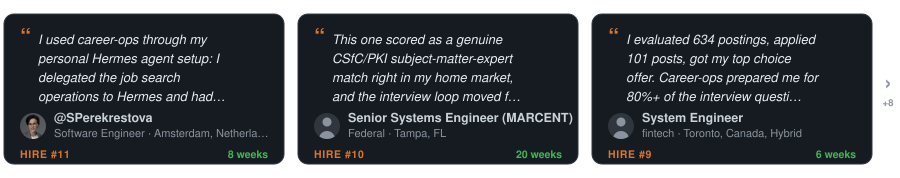

<p align="center"><picture><source media="(prefers-color-scheme: dark)" srcset="docs/wordmark-dark.svg"></picture></p>

<p align="center">
  <em>J'ai passé des mois à postuler à des emplois à la dure. J'ai donc conçu le système que j'aurais aimé avoir.</em><br>
  Les entreprises utilisent l'IA pour filtrer les candidats. <strong>Je viens de donner aux candidats une IA pour <em>choisir</em> leurs entreprises.</strong><br>
  Il évalue, classe et rédige. <strong>Il n'envoie jamais rien : c'est toi qui envoies.</strong> Open source, en local, à toi.
</p>

<p align="center">
  <a href="https://x.com/santifer/status/2041403685696053741"></a>
</p>

<p align="center"><sub>Un instantané en pleine recherche : le pipeline, puis une offre ouverte et évaluée de bout en bout.</sub></p>

<p align="center"><strong>Sur 740 offres, 68 valaient une candidature. 12 entretiens. 1 offre.</strong></p>
<p align="center"><sub>Une seule recherche, celle de l'auteur, 2026. Le chiffre qui compte, c'est le tri, pas le volume. Tous les chiffres dans l'<a href="https://santifer.io/career-ops-system">étude de cas</a>.</sub></p>

<p align="center"><sub>N'envoie jamais, n'expédie jamais d'e-mail, ne téléphone jamais à la maison : <a href="#ce-que-career-ops-ne-fait-pas">ce qu'il ne fait pas</a> · tourne dans la CLI d'IA que tu utilises déjà, <a href="docs/RUNNING_ON_A_BUDGET.md">modèles gratuits et locaux compris</a>.</sub></p>

<details>
<summary>Lire en 17 langues</summary>
<div align="center">

[English](README.md) | [Español](README.es.md) | [Deutsch](README.de.md) | [Français](README.fr.md) | [Português (Brasil)](README.pt-BR.md) | [한국어](README.ko-KR.md) | [日本語](README.ja.md) | [简体中文](README.cn.md) | [繁體中文](README.zh-TW.md) | [Українська](README.ua.md) | [Русский](README.ru.md) | [Polski](README.pl.md) | [Dansk](README.da.md) | [தமிழ்](README.ta.md) | [العربية](README.ar.md) | [हिन्दी](README.hi.md) | [Türkçe](README.tr.md)

</div>
</details>

<hr>

<p align="center">
  <a href="HIRED.md"></a>
</p>

<p align="center"><sub>Tu as décroché le tien ? <a href="https://github.com/career-ops-hq/career-ops/issues/new?template=i-got-hired.yml">Partage-le →</a> · ta carte montre à quelqu'un en pleine recherche que la sortie existe.</sub></p>

<p align="center">
  <a href="HIRED.md"></a>
</p>

<p align="center"><sub>Chaque décompte est une histoire publique que tu peux <a href="HIRED.md">auditer →</a> · chacune a commencé là où tu es maintenant.</sub></p>

<p align="center"><sub>VU DANS</sub></p>

<p align="center">
  <a href="https://wired.com.gr/article/to-ai-ergaleio-pou-fernei-epanastasi-ston-tropo-pou-psachnoume-douleia/" rel="noopener noreferrer nofollow"><picture><source media="(prefers-color-scheme: dark)" srcset="docs/press/wired-dark.svg"></picture></a>
  &nbsp;&nbsp;&nbsp;&nbsp;&nbsp;
  <a href="https://www.businessinsider.com/how-i-built-tool-filter-job-listings-landed-head-ai-2026-4" rel="noopener noreferrer nofollow"><picture><source media="(prefers-color-scheme: dark)" srcset="docs/press/business-insider-dark.svg"></picture></a>
</p>

<p align="center">
  <a href="https://www.producthunt.com/products/santifer-io?utm_source=badge-featured&utm_medium=badge" target="_blank" rel="noopener noreferrer"></a>
  &nbsp;&nbsp;
  <a href="https://trendshift.io/repositories/25195" target="_blank" rel="noopener noreferrer"></a>
</p>

<p align="center"><sub>Créé et maintenu par <a href="https://santifer.io">Santiago Fernández de Valderrama Aparicio</a> (<a href="https://github.com/santifer">@santifer</a>)</sub></p>

## Qu'est-ce que c'est

career-ops ([career-ops.org](https://career-ops.org), aussi connu sous le nom de **careerops**) est une recherche d'emploi par IA, open source, qui tourne en local dans n'importe quelle CLI de codage IA : elle évalue les offres, adapte ton CV et suit chaque candidature, et c'est toujours toi qui as le dernier mot. Au lieu de suivre tes candidatures à la main dans un tableur, tu obtiens un pipeline propulsé par l'IA qui :

- **Évalue les offres** dans un rapport structuré : blocs A à H, avec un score global de 1 à 5 obtenu par un jugement d'ensemble sur cinq dimensions plutôt que par une formule arithmétique. La colonne d'importance par exigence du bloc B et l'évaluation de légitimité de l'annonce du bloc G sont deux signaux à part, neutres pour le score, qui ne l'affectent jamais ; le bloc H n'est rédigé qu'à partir de 4,5
- **Génère des PDF sur mesure** : des CV optimisés pour les ATS, personnalisés pour chaque description de poste
- **Scanne les portails** automatiquement (Greenhouse, Ashby, Lever, pages carrières des entreprises)
- **Traite par lots** : évalue 10+ offres en parallèle avec des sous-agents
- **Suit tout** dans une source de vérité unique avec des contrôles d'intégrité
- **Recherche les entreprises et trouve la bonne personne à contacter** : la candidature te met dans la file d'attente ; la recherche t'obtient une conversation

> **Important : ce n'est PAS un outil pour postuler en rafale.** career-ops est un filtre : il t'aide à trouver, parmi des centaines d'offres, les quelques-unes qui valent ton temps. Le système déconseille fortement de postuler à tout ce qui obtient moins de 4,0/5. Ton temps est précieux, et celui du recruteur aussi. Relis toujours avant d'envoyer.

career-ops est agentique : la CLI de codage IA de ton choix navigue sur les pages carrières avec Playwright, évalue l'adéquation en raisonnant sur ton CV face à la description du poste (pas de simple correspondance de mots-clés) et adapte ton CV à chaque offre.

> **Attention : les premières évaluations ne seront pas fameuses.** Le système ne te connaît pas encore. Donne-lui du contexte : ton CV, ton parcours, tes preuves de réussite, tes préférences, ce que tu sais bien faire, ce que tu veux éviter. Plus tu le nourris, meilleur il devient. Vois ça comme l'intégration d'un nouveau recruteur : la première semaine, il doit apprendre à te connaître, ensuite il devient indispensable.

Construit par quelqu'un qui s'en est servi pour évaluer 740 offres, postuler à 68 et décrocher un poste de Head of Applied AI. [Lire l'étude de cas complète](https://santifer.io/career-ops-system).

## Ce que career-ops ne fait pas

- **Envoyer une candidature.** Il prépare les réponses ; tu ouvres le formulaire et tu cliques sur Envoyer. Le script ne fait jamais de POST (`prepare-application.mjs`).
- **Envoyer un e-mail.** Brouillons uniquement. Il n'y a aucun transport de courrier dans ce code.
- **Téléphoner à la maison.** Pas de télémétrie, pas de backend à nous. Ton CV va de ta machine au fournisseur d'IA que tu as choisi, et nulle part ailleurs. Le seul registre public, c'est ce dépôt : `HIRED.md` et ses issues.
- **Te pousser à postuler sous 4,0/5.** Il te dira de ne pas le faire. Tu peux passer outre, et il te le dira.

Il reformule ton CV ; il ne doit jamais l'inventer. Aujourd'hui cette règle vit dans les prompts, pas encore dans un contrôle bloquant. Relis chaque CV avant de l'envoyer. Détails dans la [FAQ](#faq).

## Le Manifeste CareerOps

career-ops est la première implémentation de référence du [Manifeste CareerOps](https://career-ops.org/manifesto?utm_source=readme). lis-le. s'il dit ce que tu crois, signe-le. ta signature devient un commit.

## Fonctionnalités

| Fonctionnalité           | Description                                                                                                                              |
| ------------------------ | ---------------------------------------------------------------------------------------------------------------------------------------- |
| **Pipeline automatique** | Colle une URL, obtiens une évaluation complète + PDF + entrée dans le tracker                                                            |
| **Évaluation A-H**       | Résumé du poste, correspondance avec le CV (avec le poids de chaque exigence pour cette annonce et l'origine de ce poids : formulation de la description, structure ou estimation, indiquée exigence par exigence ; une estimation ne peut jamais atteindre le niveau le plus élevé), stratégie de niveau, recherche de rémunération, personnalisation, préparation à l'entretien (STAR+R), plus une vérification de légitimité de l'annonce au bloc G qui signale les arnaques et les offres fantômes, et un signal d'autorisation de travail qui marque comme bloquant toute description excluant explicitement le parrainage de visa |
| **Banque d'histoires d'entretien** | Accumule des récits STAR+Réflexion au fil des évaluations : 5 à 10 histoires maîtresses qui répondent à n'importe quelle question comportementale |
| **Scripts de négociation** | Cadres de négociation salariale, réponse aux décotes géographiques, levier des offres concurrentes                                     |
| **Génération de PDF ATS** | CV avec injection de mots-clés et design Space Grotesk + DM Sans                                                                         |
| **Générateur de lettres de motivation** | Lettres fondées sur la recherche avec reflet des mots-clés, quatre questions interactives d'angle (pourquoi/problèmes/approche/ton), validation du brouillon dans le chat et PDF A4 via le même pipeline HTML + Playwright que les CV. Rédige un brouillon à chaque évaluation ; complète et génère à la demande avec `/career-ops cover` |
| **Brouillons d'e-mails de candidature** | E-mails formels pour recruteur, cooptation ou candidature spontanée à partir d'un rapport ou d'une description collée, avec objet, liste des pièces jointes, points d'adéquation sourcés et bloc de contact issu de ton profil. Brouillon uniquement : career-ops n'envoie, ne soumet et ne clique jamais rien. |
| **Scanner de portails**  | 100+ entreprises préconfigurées (Anthropic, OpenAI, ElevenLabs, Retool, n8n...) + requêtes personnalisées sur Ashby, Greenhouse, Lever, Wellfound |
| **Découverte d'entreprises financées** | La commande `company:funded`, pensée pour relire avant d'agir, fait remonter les entreprises récemment financées et des diagnostics de source à partir de flux publics structurés, sans toucher à tes données |
| **Traitement par lots**  | Évaluation en parallèle avec des workers CLI sans interface (`claude -p` / `opencode run`)                                               |
| **Dashboard TUI**        | Interface terminal pour parcourir, filtrer et trier ton pipeline                                                                         |
| **Human-in-the-Loop**    | L'IA évalue et recommande, tu décides et tu agis. Le système ne soumet jamais une candidature : c'est toujours toi qui as le dernier mot <!-- hitl: absolute guarantee. Do not add "automatically", "by itself", "without your permission" or any other hedge when translating this row. -->               |
| **Intégrité du pipeline** | Fusion automatique, déduplication, normalisation des statuts, contrôles de santé                                                        |
| **Suite d'entretien**    | Plans de préparation par blocs de temps, sessions d'entraînement avec retour, débriefs après entretien ([`interview/`](modes/interview/README.md)) et un détecteur de signaux d'alerte sur l'entreprise ([`interview-redflag`](modes/interview-redflag.md)) |
| **Phase d'offre**        | Compagnon de lecture du contrat : parcours clause par clause plus une liste de questions pour l'avocat ([`offer-prep`](modes/offer-prep.md)), et un analyseur d'écart entre salaire souhaité, annoncé et réel (`salary-gap.mjs`) |
| **Relances et réponses** | Calculateur de cadence de relance et rappels préprogrammés (`followup-cadence.mjs`, `followup-seed.mjs`) ; classification des réponses de l'employeur en mises à jour du tracker ([`reply-watch`](modes/reply-watch.md)) |
| **Analyse des tendances** | Schémas de refus et taux d'avancement par canal ATS (`analyze-patterns.mjs`), statistiques d'entonnoir sur toute la recherche (`stats.mjs`), détection des republications et des offres fantômes (`detect-reposts.mjs`) |
| **Système de plugins**   | Intégrations optionnelles (Gmail, Notion, Apify + un registre communautaire), désactivées par défaut ; voir [docs/PLUGINS.md](docs/PLUGINS.md) |
| **Au-delà du CV**        | La recherche sur l'entreprise ([`deep`](modes/deep.md)) fait remonter sa stratégie IA, ses mouvements récents, sa culture d'ingénierie et l'angle que ton profil devrait adopter. La découverte de contacts ([`contacto`](modes/contacto.md)) identifie le hiring manager, le recruteur ou le pair d'équipe qu'il vaut la peine de contacter et rédige un message LinkedIn de ≤300 caractères adapté à chaque type de contact. Les brouillons d'e-mails formels de candidature ([`email`](modes/email.md)) transforment un rapport évalué ou une description collée en objet, corps et liste de pièces jointes sans rien envoyer, soumettre ni cliquer. La candidature te met dans la file d'attente ; la recherche t'obtient une conversation. |

## Démarrage rapide

**Le plus rapide : une seule commande :**

```bash
npx @santifer/career-ops init
```

> 💡 `npx` est livré avec [Node.js](https://nodejs.org) : il exécute l'installeur une fois,
> sans rien installer globalement. Pas encore de Node ? Installe-le d'abord.
> (Tu utilises déjà une CLI Claude Code / Gemini / Codex ? Alors tu l'as déjà.)

Cela clone la dernière version dans `./career-ops` et installe les dépendances. Ensuite :

```bash
cd career-ops
claude   # or codex / qwen / opencode / agy / grok — open your AI CLI here
```

**Au premier lancement, career-ops te guide dans la configuration (ton CV, ton profil et les postes visés) simplement en discutant. Rien à éditer à la main.**

<details>
<summary><b>Tu préfères l'installer à la main ? (git clone)</b></summary>

```bash
git clone https://github.com/career-ops-hq/career-ops.git
cd career-ops && npm install
npx playwright install chromium   # only needed for PDF generation

# 2. Check setup
npm run doctor                     # Validates all prerequisites

# 3. Configure
cp config/profile.example.yml config/profile.yml  # Edit with your details
cp templates/portals.example.yml portals.yml       # Customize companies

# 4. Add your CV
# Create cv.md in the project root with your CV in markdown

# 5. Open your AI CLI in this directory
claude   # or codex / opencode / qwen / agy / grok

# Then ask your CLI to adapt the system to you:
# "Change the archetypes to backend engineering roles"
# "Translate the modes to English"
# "Add these 5 companies to portals.yml"
# "Update my profile with this CV I'm pasting"

# 6. Start using
# Paste a job URL or JD text to trigger auto-pipeline
# If your CLI supports slash commands, use /career-ops (or its CLI-specific alias)
# In Codex, ask for the same mode in plain language, e.g.:
# "Run the career-ops scan mode"
# "Run the career-ops pipeline mode for data/pipeline.md"
# "Run the career-ops pdf mode for the latest evaluated role"
# "Run the career-ops tracker mode and summarize the current statuses"
```

</details>

### Installation globale

```bash
npm i -g @santifer/career-ops
```

Cela installe le binaire `career-ops` globalement pour que tu puisses l'exécuter directement plutôt que via `npx`. Contrairement à `npx @santifer/career-ops init` (qui prépare un dossier de projet), l'installation globale te donne une commande `career-ops` persistante, disponible partout dans ton terminal.

**Laquelle utiliser ?**
- `npx @santifer/career-ops init` : idéal pour la première utilisation ; crée un dossier de projet dédié.
- `npm i -g @santifer/career-ops` : idéal une fois que tu as un dossier de projet et que tu veux lancer les commandes career-ops directement.

> **Le système est conçu pour être personnalisé par ta CLI de codage IA elle-même.** Modes, archétypes, pondérations du score, scripts de négociation : demande-lui simplement de les changer. Elle lit les mêmes fichiers qu'elle utilise, donc elle sait exactement quoi éditer.

Voir [docs/SETUP.md](docs/SETUP.md) pour le guide d'installation complet, [docs/RUNNING_ON_A_BUDGET.md](docs/RUNNING_ON_A_BUDGET.md) pour faire tourner career-ops à moindre coût avec des modèles personnalisés ou locaux (et [docs/FREE_TIER.md](docs/FREE_TIER.md) pour le faire tourner gratuitement sur l'offre gratuite d'Antigravity CLI), [docs/AUTOMATION.md](docs/AUTOMATION.md) pour planifier des scans récurrents et une recette de tri vers une liste courte sans dépenser de tokens, [docs/APPLY_AUTOFILL.md](docs/APPLY_AUTOFILL.md) pour les détails du flux de remplissage automatique des ATS, [docs/LINKEDIN_JOIN.md](docs/LINKEDIN_JOIN.md) pour croiser un export de tes relations LinkedIn avec les entreprises de ton entonnoir, et [docs/FAQ.md](docs/FAQ.md) pour les réponses aux questions courantes de configuration, dont [comment la provenance des histoires empêche les chiffres inventés](docs/FAQ.md#why-does-career-ops-refuse-to-use-a-number-from-my-story-bank). Les principes de conception sont dans [ARCHITECTURE.md](ARCHITECTURE.md) ; les flux d'exécution dans [docs/ARCHITECTURE.md](docs/ARCHITECTURE.md).

## Intégration Antigravity CLI

career-ops prend en charge Antigravity CLI nativement, de la même façon que Claude Code et OpenCode. Toutes les commandes slash sont disponibles via le point d'entrée partagé du skill, avec la même logique d'évaluation `modes/*.md`.

Google a fait migrer l'accès grand public de Gemini CLI vers Antigravity CLI. `GEMINI.md` est désormais une garde de compatibilité sans effet, pour qu'Antigravity ne duplique pas les instructions complètes du projet lorsqu'il lit à la fois `AGENTS.md` et `GEMINI.md`.

### Antigravity CLI natif

```bash
# 1. Run in the career-ops directory
cd career-ops
agy

# 2. Use the unified /career-ops command with subcommands:
/career-ops "Senior AI Engineer at Anthropic..."
/career-ops pipeline
/career-ops scan
/career-ops pdf
/career-ops tracker
```

Le skill est défini selon le standard ouvert dans `.agents/skills/career-ops/SKILL.md` et lié ou référencé pour chaque CLI prise en charge (par exemple `.claude/`, `.cursor/`, `.qwen/`, `.antigravitycli/`, `.grok/`).

## Intégration Codex

career-ops prend en charge Codex via le même routeur partagé, mais le modèle d'invocation diffère des CLI qui enregistrent automatiquement les commandes slash. Le guide complet est dans [docs/CODEX.md](docs/CODEX.md).

### Codex interactif

```bash
cd career-ops
codex
```

Les commandes slash ne sont pas garanties dans Codex. Si `/career-ops` n'est pas disponible, demande à Codex d'exécuter le mode directement en langage naturel :

```text
Evaluate this JD with career-ops auto-pipeline: https://company.com/jobs/123
Run the career-ops scan mode and summarize new matches.
Run the career-ops pipeline mode for data/pipeline.md.
Run the career-ops pdf mode for the latest evaluated role.
Run the career-ops tracker mode and summarize the current statuses.
```

### Codex en un seul passage (`codex exec`)

```bash
codex exec "Evaluate this JD with career-ops auto-pipeline: https://company.com/jobs/123"
codex exec "Run career-ops scan mode in this repo and summarize new matches."
codex exec "Run career-ops pipeline mode for data/pipeline.md."
codex exec "Run career-ops pdf mode for the latest evaluated role."
codex exec "Run career-ops tracker mode and summarize the current statuses."
```

## Intégration Grok Build CLI

career-ops prend en charge Grok Build CLI nativement, de la même façon que Claude Code et OpenCode. `AGENTS.md` est chargé automatiquement comme règles du projet, et toutes les commandes slash sont disponibles via le point d'entrée partagé du skill.

### Grok Build CLI natif

```bash
# 1. Run in the career-ops directory
cd career-ops
grok

# 2. Use the unified /career-ops command with subcommands:
/career-ops "Senior AI Engineer at Anthropic..."
/career-ops pipeline
/career-ops scan
/career-ops pdf
/career-ops tracker
```

Pour des workers de lot sans interface, utilise `grok -p "prompt"` (ajoute `--yolo` pour approuver automatiquement l'exécution des outils).

### Script autonome avec l'API Gemini (sans installer de CLI)

```bash
# 1. Get a free API key at https://aistudio.google.com/apikey
cp .env.example .env
# Edit .env, set GEMINI_API_KEY=your_key_here

# 2. Install dependencies
npm install

# 3. Evaluate a job description
node gemini-eval.mjs "We are looking for a Senior AI Engineer..."
node gemini-eval.mjs --file ./jds/my-job.txt
node agent-inbox.mjs add "..."   # queue a request for the next session
npm run gemini:eval -- "JD text here"
```

> **Offre gratuite :** les deux options fonctionnent sans facturation. La CLI native utilise Google OAuth ; le script API utilise `gemini-3.6-flash` (les limites de débit dépendent du modèle et du palier ; consulte la documentation Google AI pour les quotas en vigueur).

## Utilisation

career-ops utilise un routeur de commandes partagé. Dans les CLI qui enregistrent des commandes slash, ça ressemble à ceci :

```
/career-ops           → Afficher toutes les commandes disponibles
/career-ops {JD}      → PIPELINE AUTOMATIQUE : évaluation + rapport + PDF + tracker (colle du texte ou une URL)
/career-ops pipeline  → Traiter les URL en attente de la boîte d'entrée (data/pipeline.md)
/career-ops oferta    → Évaluation seule, blocs A à G (sans PDF automatique)
/career-ops ofertas   → Comparer et classer plusieurs offres
/career-ops contacto  → Coup de maître LinkedIn : trouver des contacts + rédiger le message
/career-ops deep      → Prompt de recherche approfondie sur l'entreprise
/career-ops interview-prep → Générer un document de préparation d'entretien propre à l'entreprise
/career-ops interview    → Entretien interactif d'intégration du profil et du CV
/career-ops eu-swe    → Calibrer une candidature SWE européenne avant le CV, la candidature ou l'entretien
/career-ops eu-fintech → Scanner 21 portails fintech européens pour des postes de Product Manager (sans tokens)
/career-ops interview/plan → Plan de préparation par blocs de temps pour un entretien à venir
/career-ops interview/practice → Entretien d'entraînement, une question à la fois avec retour
/career-ops interview/debrief → Débrief après entretien : combler les lacunes, anticiper le prochain tour
/career-ops interview-redflag → Analyser les signaux d'alerte de l'employeur avant de rejoindre une entreprise
/career-ops pdf       → PDF uniquement, CV optimisé pour les ATS
/career-ops text      → CV adapté en markdown (reflète cv.md, sans PDF)
/career-ops latex     → Exporter le CV en LaTeX/Overleaf .tex
/career-ops latex-tex → Adapter ton propre resume.tex sur place (optionnel ; cv.md reste la valeur par défaut)
/career-ops cover     → Lettre de motivation : description collée seule ou /career-ops cover {slug}
/career-ops email     → Brouillon d'e-mail formel de candidature (brouillon uniquement ; n'envoie, ne soumet et ne clique jamais)
/career-ops add       → Ajouter un projet, un article ou un poste à ton CV (récupération + aperçu + confirmation)
/career-ops expand    → Découvrir et ajouter automatiquement les compétences manquantes à partir des liens de ton profil
/career-ops training  → Évaluer un cours ou une certification par rapport à ton North Star
/career-ops project   → Évaluer une idée de projet de portfolio
/career-ops tracker   → Vue d'ensemble de l'état des candidatures
/career-ops agent-inbox → Mettre en file ou vider les demandes pour la prochaine session (data/agent-inbox.md)
/career-ops apply     → Assistant de candidature en direct (lit le formulaire + génère les réponses)
/career-ops scan      → Scanner les portails et découvrir de nouvelles offres
/career-ops discover  → Convertir une liste d'entreprises en tableaux ATS scannables + les ajouter à portals.yml (sans tokens)
/career-ops batch     → Traitement par lots avec des workers en parallèle
/career-ops patterns  → Analyser les schémas de refus et améliorer le ciblage
/career-ops offer-prep → Lire une offre ou un contrat reçu avec le candidat : parcours des clauses + questions pour l'avocat (pas un conseil juridique)
/career-ops titles    → Suggérer des intitulés de poste voisins à partir de ton CV pour élargir la recherche
/career-ops upskill   → Analyse agrégée des lacunes de compétences à partir de tes rapports évalués
/career-ops followup  → Suivi de la cadence de relance : signaler les retards, générer des brouillons
/career-ops reply-watch → Classer les réponses de l'employeur et suggérer des mises à jour du tracker
/career-ops outcome   → Enregistrer le résultat de la candidature et archiver les artefacts
/career-ops calibrate → Rapport consultatif : tes scores d'évaluation prédisent-ils tes résultats réels ? Lit les données /outcome ; ne modifie jamais le scoring
/career-ops update    → Mettre à jour les fichiers système de career-ops avec aperçu du diff + contrôle de compatibilité
```

Ou colle simplement une URL ou une description de poste : career-ops la détecte automatiquement et lance le pipeline complet.

Dans Codex, les commandes slash ne sont pas garanties. Utilise plutôt les mêmes noms de mode dans un prompt, ou appelle-les depuis `codex exec`.

## Comment ça fonctionne

```
You paste a job URL or description
        │
        ▼
┌──────────────────┐
│  Archetype       │  Classifies: LLMOps / Agentic / PM / SA / FDE / Transformation
│  Detection       │
└────────┬─────────┘
         │
┌────────▼─────────┐
│  A-H Evaluation  │  Match, gaps, comp research, STAR stories, legitimacy
│  (reads cv.md)   │
└────────┬─────────┘
         │
    ┌────┼────┐
    ▼    ▼    ▼
 Report  PDF  Tracker
  .md   .pdf  entry
```

## Portails préconfigurés

Le scanner est livré avec **100+ entreprises** prêtes à être scannées et **45+ requêtes de recherche** sur les principaux sites d'emploi. Copie `templates/portals.example.yml` vers `portals.yml` et ajoute les tiennes :

**Labos d'IA :** Anthropic, OpenAI, Mistral, Cohere, LangChain, Pinecone
**IA vocale :** ElevenLabs, PolyAI, Parloa, Hume AI, Deepgram, Vapi, Bland AI
**Plateformes d'IA :** Retool, Airtable, Vercel, Temporal, Glean, Arize AI
**Centres de contact :** Ada, LivePerson, Sierra, Decagon, Talkdesk, Genesys
**Entreprise :** Salesforce, Twilio, Gong, Dialpad
**LLMOps :** Langfuse, Weights & Biases, Lindy, Cognigy, Speechmatics
**Automatisation :** n8n, Zapier, Make.com
**Europe :** Factorial, Attio, Tinybird, Clarity AI, Travelperk

**Sites d'emploi parcourus :** 55+ modules fournisseurs couvrent les API d'ATS, les flux de sites entiers, les flux XML/RSS, les flux markdown et les analyseurs locaux. Le tableau complet est dans [Sites d'emploi pris en charge](docs/SUPPORTED_JOB_BOARDS.md).

Par défaut, `node scan.mjs` (alias `npm run scan`) fait confiance à ce que renvoie chaque flux ATS. Certaines entreprises laissent des annonces périmées dans leur API publique même après la clôture du poste, si bien que ces entrées expirées peuvent se glisser dans `pipeline.md`. Passe `--verify` pour lancer Playwright après le passage par l'API et écarter les annonces expirées avant qu'elles n'atteignent le pipeline :

```bash
node scan.mjs --verify          # zero-token discovery + Playwright liveness check
```

La vérification est séquentielle et ne porte que sur les nouvelles offres (après déduplication), donc le coût reste borné.

## Dashboard TUI

Le tableau de bord intégré au terminal te permet de parcourir ton pipeline visuellement :

```bash
npm run serve:dashboard   # launch the TUI
npm run build:dashboard   # optional: build the standalone binary
```

Fonctionnalités : 6 onglets de filtre, 4 modes de tri, vue groupée ou à plat, aperçus en chargement différé, changements de statut en ligne.

Il existe aussi une **interface web expérimentale** (alpha, optionnelle : rien ne tourne tant que tu ne la lances pas) : voir [`web/README.md`](web/README.md).

## Structure du projet

```
career-ops/
├── AGENTS.md                    # Canonical agent instructions (all CLIs)
├── CLAUDE.md                    # Claude Code wrapper (imports AGENTS.md)
├── CODEX.md                     # Codex wrapper (imports AGENTS.md)
├── OPENCODE.md                  # OpenCode wrapper (imports AGENTS.md)
├── GEMINI.md                    # Legacy no-op guard to avoid Antigravity duplicate context
├── cv.md                        # Your CV (create this)
├── article-digest.md            # Your proof points (optional)
├── config/
│   └── profile.example.yml      # Template for your profile
├── modes/                       # Skill modes
│   ├── _shared.md               # Shared context (customize this)
│   ├── oferta.md                # Single evaluation
│   ├── pdf.md                   # PDF generation
│   ├── cover.md                 # Cover letter generation
│   ├── email.md                 # Formal application email drafts
│   ├── scan.md                  # Portal scanner
│   ├── batch.md                 # Batch processing
│   └── ...
├── templates/
│   ├── cv-template.html         # ATS-optimized CV template
│   ├── portals.example.yml      # Scanner config template
│   └── states.yml               # Canonical statuses
├── batch/
│   ├── batch-prompt.md          # Self-contained worker prompt
│   └── batch-runner.sh          # Orchestrator script
├── dashboard/                   # Go TUI pipeline viewer
├── data/                        # Your tracking data (gitignored)
├── reports/                     # Evaluation reports (gitignored)
├── output/                      # Generated PDFs (gitignored)
├── fonts/                       # Space Grotesk + DM Sans
├── docs/                        # Setup, customization, budget guide, architecture
└── examples/                    # Sample CV, report, proof points
```

## Répertoire de données externe (optionnel)

Par défaut, les données de la couche utilisateur (comme `cv.md`, `portals.yml` et les dossiers `data/`, `reports/`, `output/`) vivent dans le dossier racine du projet.

Pour séparer tes données personnelles du code (et ainsi changer de branche, tirer des mises à jour ou tester plusieurs profils plus facilement), tu peux configurer un répertoire de données externe selon l'ordre de priorité suivant :

1. **Variables d'environnement :** définis la variable `CAREER_OPS_ROOT` ou `CAREER_OPS_DATA_DIR` :
   ```bash
   export CAREER_OPS_ROOT=~/my-career-data
   ```
2. **Fichier marqueur :** crée un fichier `.career-ops-data` à la racine du dépôt contenant le chemin vers ton répertoire de données.
3. **Par défaut :** la racine du dépôt.

Une fois résolu, tous les fichiers utilisateur sont résolus et écrits relativement à ce dossier, tandis que les fichiers de prompts et les scripts continuent d'être résolus relativement au dépôt.

- **Surcharge du tracker :** tu peux aussi définir `CAREER_OPS_TRACKER` pour indiquer directement le chemin du fichier tracker des candidatures.
- **Écritures :** toutes les opérations d'écriture (comme les fusions) visent canoniquement `{DATA_ROOT}/data/applications.md`.

Le dashboard TUI en Go, les scripts Node.js et les modes d'agent IA respectent tous automatiquement cette hiérarchie de résolution.


## Pile technique


- **Agent** : CLI de codage IA avec skills et modes partagés (`AGENTS.md` + wrapper par CLI)
- **PDF** : Playwright + template HTML
- **Lettres de motivation** : template HTML + Playwright (PDF A4, même pipeline que les CV)
- **Scanner** : Playwright + API Greenhouse + WebSearch
- **Dashboard** : Go + Bubble Tea + Lipgloss (thème Catppuccin Mocha)
- **Données** : tableaux Markdown + configuration YAML + fichiers TSV de lot

## Également en open source

- **[cv-santiago](https://github.com/santifer/cv-santiago)** : le site portfolio (santifer.io) avec chatbot IA, tableau de bord LLMOps et études de cas. Si tu as besoin d'un portfolio pour accompagner ta recherche d'emploi, forke-le et fais-en le tien.

## FAQ

**Qu'est-ce que career-ops ?**
career-ops est une recherche d'emploi par IA, open source, qui tourne en local dans ta CLI de codage IA (Claude Code, Codex, OpenCode et autres) et te laisse chaque décision. Il évalue les offres face à ton CV, génère des PDF adaptés aux ATS, trouve la bonne personne à contacter et suit tout au même endroit : c'est toujours toi qui as le dernier mot. C'est la première implémentation de référence du Manifeste CareerOps. Plus d'infos sur [career-ops.org](https://career-ops.org).

**Le CV personnalisé peut-il inventer des choses ?**
Il ne doit pas, et les prompts le disent : reformuler, jamais inventer. Cette règle n'est pas encore imposée par un contrôle dans le code. Deux issues ouvertes la suivent : [#2677](https://github.com/career-ops-hq/career-ops/issues/2677) (les intitulés de poste doivent correspondre à cv.md) et [#1411](https://github.com/career-ops-hq/career-ops/issues/1411) (contrôle de fidélité bloquant). Tant qu'elles ne sont pas fusionnées, relis chaque CV avant de l'envoyer. L'[avertissement légal](LEGAL_DISCLAIMER.md) dit la même chose en plus long.

**Puis-je utiliser career-ops gratuitement, ou avec un modèle moins cher / local ?**
Oui. career-ops est indépendant de la CLI et tourne avec des modèles gratuits et locaux (modèles gratuits d'OpenRouter, Ollama ou n'importe quel endpoint compatible OpenAI), donc tu n'es lié à aucun abonnement payant. Voir [docs/RUNNING_ON_A_BUDGET.md](docs/RUNNING_ON_A_BUDGET.md) pour la configuration complète.

**Je paie Claude Pro/Max mais career-ops consomme des crédits API. Pourquoi ?**
Parce qu'une `ANTHROPIC_API_KEY` dans ton environnement prend le pas sur ton abonnement connecté : la CLI utilise la clé et facture au token. Lance `echo $ANTHROPIC_API_KEY` et, si quelque chose s'affiche, retire-la de ton profil shell, redémarre le terminal et lance `/login`. Le mode par lots est l'exception, car les workers `claude -p` n'utilisent pas la connexion interactive : lance `claude setup-token` une fois et exporte le résultat comme `CLAUDE_CODE_OAUTH_TOKEN`. Guide complet dans [docs/RUNNING_ON_A_BUDGET.md](docs/RUNNING_ON_A_BUDGET.md#2b-already-paying-for-a-subscription-make-sure-you-are-using-it).

**Avec quelles CLI d'IA career-ops fonctionne-t-il ?**
career-ops tourne sur n'importe quelle grande CLI de codage IA (Claude Code, Codex, Gemini / Antigravity, OpenCode, Grok, Qwen et plus) via le standard ouvert Agent Skill Standard, donc il n'est jamais lié à un seul fournisseur. Utilise la CLI que tu as déjà.

**Comment installer career-ops sous Windows ?**
career-ops fonctionne sous Windows. La configuration propre à la plateforme et ses pièges connus (détection de Git Bash, fins de ligne, Planificateur de tâches) sont dans [docs/WINDOWS.md](docs/WINDOWS.md). Si les skills ne se chargent pas à cause d'une erreur de lien symbolique pendant l'installation, la solution est dans [docs/FAQ.md](docs/FAQ.md). Les étapes complètes sont dans [docs/SETUP.md](docs/SETUP.md).

**career-ops postule-t-il aux offres à ma place ?**
Non. career-ops est un filtre, pas un robot qui postule en rafale. L'IA évalue, classe et rédige ; tu relis et tu décides. Il n'envoie, ne soumet et ne clique jamais rien : c'est toujours toi qui as le dernier mot. Cette conception avec l'humain aux commandes, c'est tout l'intérêt.

**career-ops est-il gratuit et open source ?**
Oui. career-ops est gratuit et open source, et pour le candidat il le restera toujours : c'est la première implémentation de référence du [Manifeste CareerOps](https://career-ops.org/manifesto). Lis-le, et s'il dit ce que tu crois, signe-le.

## À propos de l'auteur

Je m'appelle [Santiago Fernández de Valderrama Aparicio](https://santifer.io/about) (santifer) : Head of Applied AI, ancien fondateur (j'ai créé et vendu une entreprise qui fonctionne toujours sous mon nom). J'ai construit career-ops pour gérer ma propre recherche d'emploi. Ça a marché : je l'ai utilisé pour décrocher mon poste actuel.

Curieux de savoir comment ce dépôt est maintenu en environ 4 heures par semaine ? Lis [Agentic maintenance: how career-ops is run by a fleet of AI agents](https://santifer.io/ai-agent-fleet).

Mon portfolio et mes autres projets open source → [santifer.io](https://santifer.io)

Wikidata : [Santiago Fernández de Valderrama Aparicio](https://www.wikidata.org/wiki/Q138710224) · [career-ops](https://www.wikidata.org/wiki/Q139007988).

## Clause de non-responsabilité

**career-ops est un outil local et open source, PAS un service hébergé.** En utilisant ce logiciel, tu reconnais que :

1. **Tu contrôles tes données.** Ton CV, tes coordonnées et tes données personnelles restent sur ta machine et sont envoyés directement au fournisseur d'IA que tu choisis (Anthropic, OpenAI, etc.). Nous ne collectons, ne stockons ni n'avons accès à aucune de tes données.
2. **Tu contrôles l'IA.** Les prompts par défaut demandent à l'IA de ne pas soumettre de candidatures automatiquement, mais les modèles d'IA peuvent se comporter de manière imprévisible. Si tu modifies les prompts ou utilises d'autres modèles, tu le fais à tes risques. **Vérifie toujours l'exactitude du contenu généré par l'IA avant de l'envoyer.**
3. **Tu respectes les conditions d'utilisation des tiers.** Tu dois utiliser cet outil conformément aux conditions d'utilisation des portails de recrutement avec lesquels tu interagis (Greenhouse, Lever, Workday, LinkedIn, etc.). N'utilise pas cet outil pour spammer les employeurs ni pour saturer les systèmes ATS.
4. **Aucune garantie.** Les évaluations sont des recommandations, pas des vérités. Les modèles d'IA peuvent halluciner des compétences ou de l'expérience. Les auteurs ne sont pas responsables des résultats d'embauche, des candidatures refusées, des restrictions de compte ni d'aucune autre conséquence.

Voir [LEGAL_DISCLAIMER.md](LEGAL_DISCLAIMER.md) pour tous les détails. Ce logiciel est fourni sous [Licence MIT](LICENSE) « en l'état », sans garantie d'aucune sorte.

## Contributeurs

<a href="https://github.com/career-ops-hq/career-ops/graphs/contributors">
  
</a>

Toutes les personnes qui ont livré du code, de la documentation, des traductions ou des tests sont listées dans
[CONTRIBUTORS.md](CONTRIBUTORS.md), y compris les contributions hors code, que
le graphique ci-dessus ne peut pas montrer.

Tu as été embauché grâce à career-ops ? [Partage ton histoire !](https://github.com/career-ops-hq/career-ops/issues/new?template=i-got-hired.yml)

## Licence et marques déposées

Le code est distribué sous [Licence MIT](LICENSE). Le nom et la marque
« career-ops » sont régis par la [Politique de marques déposées](TRADEMARK.md),
permissive pour l'usage communautaire, réservée pour la dénomination de
produits commerciaux et les endossements.

## Reconnaissance

<p align="center">
  <a href="https://warpchart.dev/hq">
    <picture>
      <source media="(prefers-color-scheme: dark)" srcset="https://warpchart.dev/api/chart?theme=dark&v=3">
      
    </picture>
  </a>
</p>

<p align="center">
  <a href="https://discord.gg/8pRpHETxa4"></a>
</p>

<p align="center">
  <a href="https://github.com/career-ops-hq/career-ops/releases/latest"></a>
</p>

<p align="center">
  <a href="https://claude.com/claude-code"></a>
</p>

<p align="center">
  <sub>Tourne aussi sur n'importe quelle CLI conforme au standard agent-skill. Voir <a href="docs/SUPPORTED_CLIS.md">CLI prises en charge</a>.</sub><br>
  
  
  
  
  
  
  
  
  <br>
  
  
  
  
  
  <a href="TRADEMARK.md"></a>
</p>

## Connectons-nous

[](https://santifer.io)
[](https://linkedin.com/in/santifer)
[](https://x.com/santifer)
[](https://discord.gg/8pRpHETxa4)
[](mailto:hi@santifer.io)
